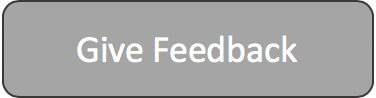

# Welcome to Dev Labs, let's get started!

This is a set of developer oriented labs built for one of the aws summit events. If you're doing these at a summit then free lab accounts will be provided for you. If you are running these labs in your own aws accounts then you will incur charges for the resources provisioned for the labs.

Each lab takes approximately 15 minutes.

> Disclaimer: These labs are meant for learning purposes only, they are not meant to be used in production in any way shape or form.

## Instructions

* Select a lab to work through
* Click on "Lab Instructions"
* Click on "Go to Console"
* Follow instructions of specific lab to walk through it
* Fill in "Give Feedback" to be in the draw to win a $50 Amazon gift voucher
* Enjoy!

## Select a lab from below to begin

### **1) Building and Debugging Lambdas with Cloud9**

Build a simple Lambda Function that sits behind an API gateway endpoint, learn how to use the Cloud9 IDE to Build, Debug and Deploy this Function.

</a>

### **2) Build and run a Containerized web app using ECS & Docker**

In this lab we will learn how to build and run a containerised application. We will then use the Amazon Elastic Container Service to host and run this container in the Cloud.

### **3) Build an appointment scheduler with Lex & Twilio**

This Lab will walk you through how you can use Amazon Lex with Twilio to create an office scheduler. Appointments will be facilitated with the afformentioned services and stored in DynamoDB.

### **4) Working effectively with the AWS Command Line Interface**

Learn how to become a super efficient user of the aws cli

### **5) Integrate Your Favourite Microsoft DevOps Tools With AWS**

This lab demonstrates how you can integrate AWS Elastic Beanstalk with Azure DevOps to automatically deploy an ASP.NET core MVC application. 

### **6) Build An Alexa-Hosted Fact Skill**

With an Alexa-hosted skill, you can build, edit, and publish a skill without leaving the developer console.

<!-- <a Give feedback Here href="https://amazonmr.au1.qualtrics.com/jfe/form/SV_8iFTqOCQLsRug85"> Give Feedback Here</a> -->

## Scan to with phone camera to give feedback

We really appreciate your feedback and would love to hear about what you loved and what we can improve.

#### Please give us feedback so we can improve these labs.

